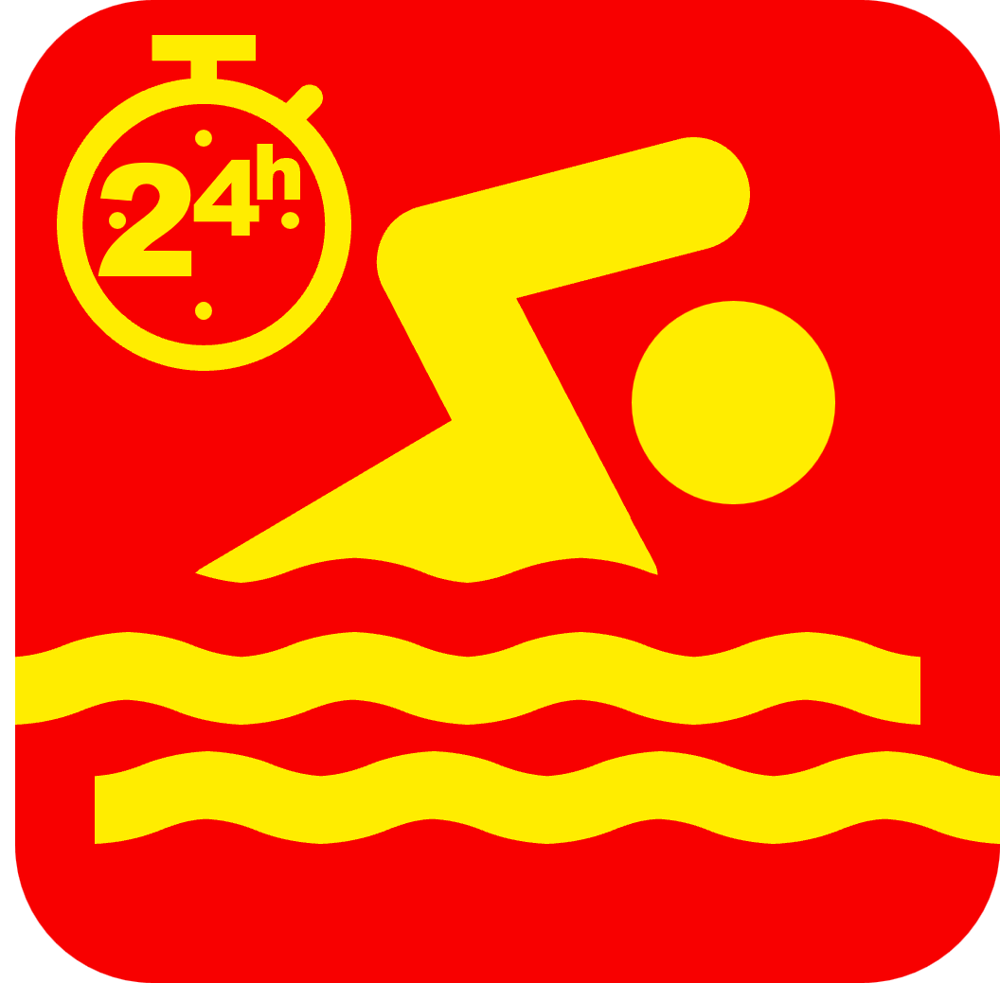
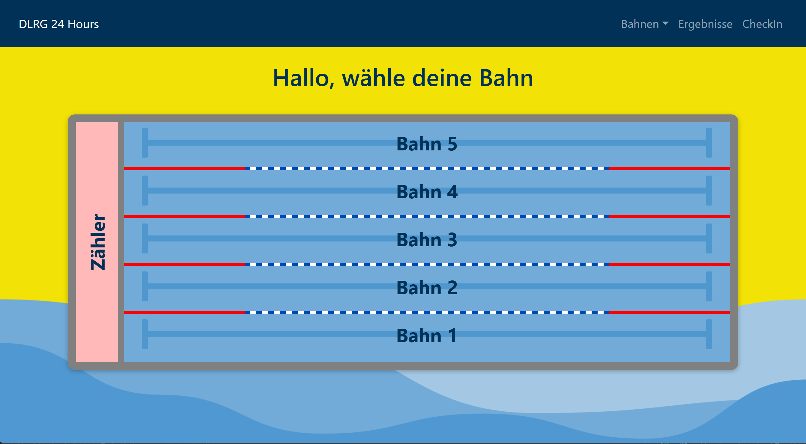
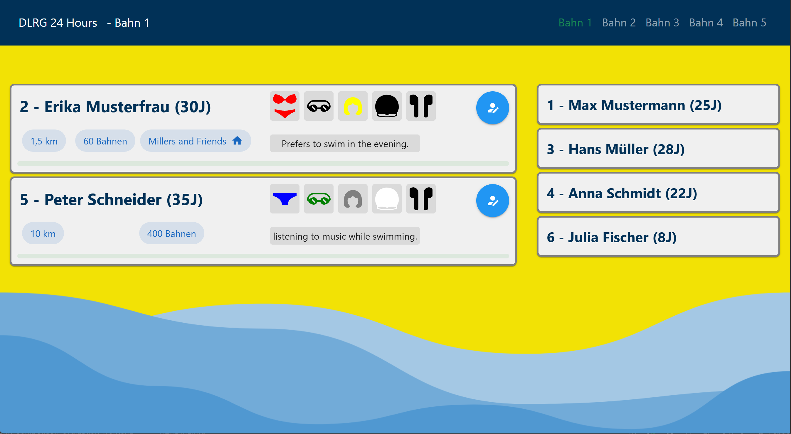
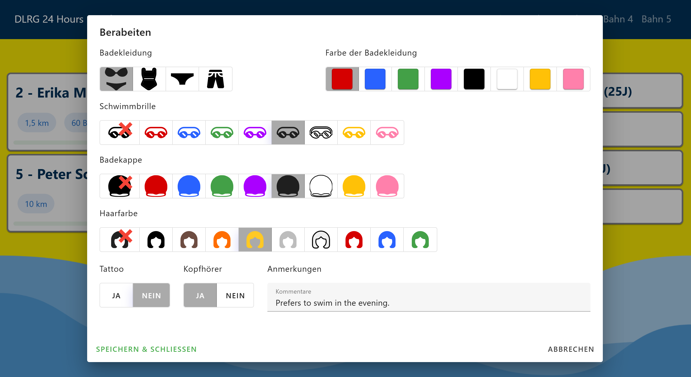

<div align="center">
  

  <h1>24h Swim Tracker</h1>

  <p>Echtzeit-Auswertungssystem für 24-Stunden-Schwimmveranstaltungen</p>

  
  
  
  
  

</div>

---

## Über das Projekt

Der **24h Swim Tracker** ist eine webbasierte Anwendung zur Verwaltung und Auswertung von 24-Stunden-Schwimmveranstaltungen. Zählerinnen und Zähler erfassen pro Bahn in Echtzeit die geschwommenen Längen, während eine Ergebnisansicht den aktuellen Stand aller Teilnehmenden anzeigt.

Entwickelt für die **DLRG Ebern** – mit dem Ziel, das System später für beliebige Vereine und Veranstaltungen nutzbar zu machen.

---

## Screenshots

### Bahnauswahl
Die Startseite zeigt eine grafische Darstellung des Schwimmbades. Per Klick auf eine Bahn gelangt man zur Zähleransicht.



### Zähleransicht
Pro Bahn werden aktive Schwimmerinnen und Schwimmer mit ihren Merkmalen (Badekleidung, Brille, Kappe etc.) und der aktuellen Distanz angezeigt. Ein Klick auf eine Karte zählt eine Länge (50 m) – mit 10-Sekunden-Sperrzeit gegen Doppelklicks.



### Schwimmer bearbeiten
Äußerliche Merkmale der Schwimmenden lassen sich visuell erfassen, um sie im Wasser eindeutig identifizieren zu können.



---

## Features

- **Bahnübersicht** – grafische Pooldarstellung mit klickbaren Bahnen
- **Echtzeit-Zählung** – Längen per Klick erfassen, Distanz wird live berechnet
- **Schwimmer-Merkmale** – Badekleidung, Farbe, Brille, Kappe, Haarfarbe, Tattoo, Kopfhörer visuell auswählbar
- **Aktiv / Pausiert / Ausgeblendet** – drei Zustände pro Schwimmer für flexible Verwaltung
- **Ergebnisanzeige** – scrollende TV-Ansicht für die Anzeigetafel
- **Bahnverwaltung** – Bahnen dynamisch hinzufügen und entfernen (Admin-Ansicht)

---

## Tech Stack

| Bereich | Technologie |
|---|---|
| Framework | [Vue 3](https://vuejs.org/) (Options API) |
| UI-Komponenten | [Vuetify 3](https://vuetifyjs.com/) |
| Build-Tool | [Vite 7](https://vitejs.dev/) |
| State Management | [Pinia 2](https://pinia.vuejs.org/) |
| Routing | [Vue Router 4](https://router.vuejs.org/) |
| Icons | [Material Design Icons](https://materialdesignicons.com/) |

---

## Lokale Entwicklung

### Voraussetzungen

- [Node.js](https://nodejs.org/) (v18 oder neuer)
- npm

### Setup

```bash
# In den Projektordner wechseln
cd Vue-3

# Abhängigkeiten installieren
npm install

# Entwicklungsserver starten (erreichbar im lokalen Netz)
npm run dev
```

Der Dev-Server ist nach dem Start unter `http://localhost:5173` erreichbar und durch das `--host`-Flag auch von anderen Geräten im selben Netzwerk.

### Weitere Befehle

```bash
npm run build          # Produktions-Build erstellen
npm run lint           # Code-Qualität prüfen (ESLint)
npm run storybook      # Komponenten-Explorer auf Port 6006 starten
```

---

## Roadmap

- [ ] Vollständige Migration auf Vuetify (Bootstrap-Vue-Next entfernen)
- [ ] Touch- und Mobile-Optimierung
- [ ] Check-In-Seite fertigstellen
- [ ] Backend-Anbindung & Datenbankanbindung
- [ ] Docker-Deployment im lokalen Netz (`24hAuswertung.local`)
- [ ] Öffentliche Veröffentlichung für andere Vereine

---

## Lizenz

Dieses Projekt ist aktuell **nicht öffentlich lizenziert**. Eine Open-Source-Lizenz ist für eine spätere Version geplant.

---

## Danksagung

Inspiriert durch die Arbeit von **S.H.** (SNG), auf deren Konzept dieses Projekt aufbaut – vollständig neu entwickelt mit modernem Tech-Stack.