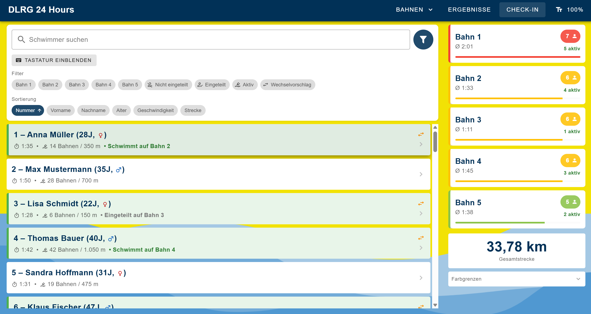
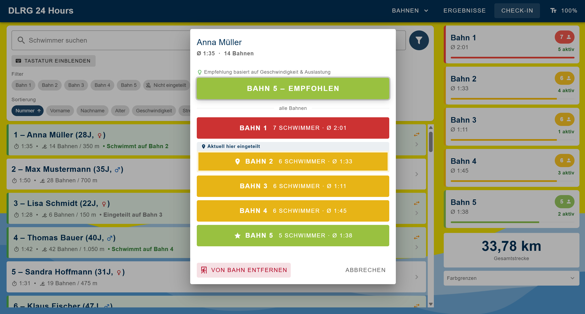
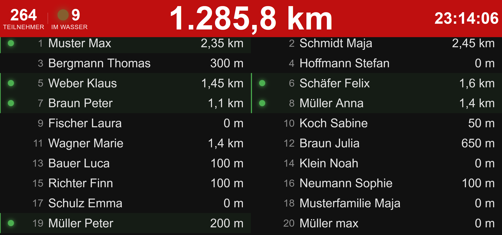

<div align="center">
  

  <h1>24h Swim Tracker</h1>

  <p>Echtzeit-Auswertungssystem für 24-Stunden-Schwimmveranstaltungen</p>

  
  
  
  
  
  

</div>

---

## Über das Projekt

Der **24h Swim Tracker** ist eine webbasierte Anwendung zur Verwaltung und Auswertung von 24-Stunden-Schwimmveranstaltungen. Zählerinnen und Zähler erfassen pro Bahn in Echtzeit die geschwommenen Längen, während eine Ergebnisansicht den aktuellen Stand aller Teilnehmenden anzeigt.

Entwickelt für die **DLRG Ebern** – mit dem Ziel, das System später für beliebige Vereine und Veranstaltungen nutzbar zu machen.

---

## Screenshots

### Bahnauswahl
Die Startseite zeigt eine grafische Darstellung des Schwimmbades. Per Klick auf eine Bahn gelangt man zur Zähleransicht.


### Zähleransicht
Pro Bahn werden aktive Schwimmerinnen und Schwimmer mit ihren Merkmalen (Badekleidung, Brille, Kappe etc.) und der aktuellen Distanz angezeigt. Ein Klick auf eine Karte zählt eine Länge (50 m) – mit 10-Sekunden-Sperrzeit gegen Doppelklicks.


### Schwimmer bearbeiten
Äußerliche Merkmale der Schwimmenden lassen sich visuell erfassen, um sie im Wasser eindeutig identifizieren zu können.


### Check-In
Schwimmer suchen, nach Bahn/Status filtern und einer Bahn zuweisen. Die Bahnen werden farblich (gelb/rot) nach Auslastung markiert. Auf dem Handy gibt es eine kompakte Bahnleiste oben.



### Schwimmer zuweisen
Dialog zur direkten Bahnzuweisung beim Check-In – inklusive Vorschlag einer besser passenden Bahn.



### Ergebnisanzeige
TV-Anzeigemodus mit automatisch scrollenden Ergebnissen, aktueller Uhrzeit, Gesamtdistanz aller Schwimmenden, Gesamtdistanz der aktuell aktiven Schwimmenden sowie einer Anzeige, wer sich gerade im Wasser befindet.



---

## Features

### Bahnansicht
- Grafische Pooldarstellung – Klick auf eine Bahn öffnet die Zähleransicht
- Längen per Klick/Tap erfassen (50 m pro Bahn), 10-Sekunden-Sperrzeit gegen Doppelklicks
- Drei Schwimmer-Zustände: **aktiv** (volle Karte) / **minimiert** (kompakte Zeile) / **inaktiv** (rechte Seitenleiste)
- Einklappbare Inaktiven- und Warteliste
- Erkennungsmerkmale mit farbigen SVG-Icons: Badekleidung, Farbe, Brille, Kappe, Haarfarbe, Tattoo, Kopfhörer
- Geschlechtsanzeige per Icon (m/w/d)
- Medaillen-Anzeige für die U18-Sonderwertung
- Aktive Schwimmer werden nach voraussichtlichem Ankommen (ETA) sortiert
- Verbindungsstatus-Banner zeigt an, wenn die Verbindung zum Backend unterbrochen ist
- Variable Schriftgröße: 80 % / 100 % / 120 % / 150 % – umschaltbar per Knopf
- Responsive Navigation: direkte Bahnbuttons auf Desktop, Hamburger-Menü auf Mobilgeräten

### Check-In
- Schwimmer-Suche mit optionaler virtueller Tastatur (On-Screen)
- Filter nach Bahn, Status und Sortierkriterium
- Bahnauslastung mit konfigurierbaren Farbgrenzen (gelb = voll, rot = überfüllt)
- Kompakte Bahnanzeige als horizontaler Strip auf Mobilgeräten
- „Bessere Bahn"-Vorschlag beim Zuweisen

### Ergebnisse & Verwaltung
- Scrollende TV-Ergebnisanzeige mit aktueller Uhrzeit, Gesamtdistanz aller Schwimmenden, Gesamtdistanz der aktuell aktiven Schwimmenden und Anzeige der aktuell im Wasser befindlichen Personen
- Admin-Ansicht zum Hinzufügen und Entfernen von Bahnen

---

## Tech Stack

| Bereich | Technologie |
|---|---|
| Framework | [Vue 3](https://vuejs.org/) (Options API + Composition API) |
| UI-Komponenten | [Vuetify 3](https://vuetifyjs.com/) (Material Design) |
| Build-Tool | [Vite 6](https://vitejs.dev/) |
| State Management | [Pinia 2](https://pinia.vuejs.org/) |
| Routing | [Vue Router 4](https://router.vuejs.org/) |
| Icons | [Material Design Icons](https://materialdesignicons.com/), SVG-Komponenten via `vite-svg-loader` |
| Proxy | [Express](https://expressjs.com/) + [http-proxy-middleware](https://github.com/chimurai/http-proxy-middleware) (HTTP + WebSocket/SignalR) |


---

## Lokale Entwicklung

### Voraussetzungen

- [Node.js](https://nodejs.org/) (v18 oder neuer)
- npm

### Frontend starten

```bash
# In den Projektordner wechseln
cd Vue-3

# Abhängigkeiten installieren
npm install

# Entwicklungsserver starten (erreichbar im lokalen Netz)
npm run dev
```

Der Dev-Server ist nach dem Start unter `http://localhost:5173` erreichbar und durch das `--host`-Flag auch von anderen Geräten im selben Netzwerk.

### Weitere Befehle

```bash
npm run build            # Produktions-Build erstellen
npm run lint             # Code-Qualität prüfen (ESLint)

```

### Proxy starten

Da das Backend kein eigenes Frontend ausliefert, übernimmt der Proxy diese Aufgabe vorübergehend. Er leitet alle HTTP-Anfragen und WebSocket-Verbindungen (SignalR) vom Frontend an das Backend weiter und ist netzwerkweit erreichbar.

```bash
cd proxy

# Abhängigkeiten installieren (einmalig)
npm install

# Konfiguration anlegen
cp .env.example .env
# .env anpassen: BACKEND_URL, FRONTEND_URL, PORT

# Proxy starten
npm start
```

Der Proxy läuft standardmäßig auf Port `3001` und ist unter `http://0.0.0.0:3001` im lokalen Netz erreichbar.

#### Konfiguration (`proxy/.env`)

| Variable | Bedeutung | Standardwert |
|---|---|---|
| `BACKEND_URL` | Adresse des Backends (Laptop B) | `http://localhost:5000` |
| `FRONTEND_URL` | Adresse des Vue Dev-Servers (für CORS) | `http://localhost:5173` |
| `PORT` | Port des Proxy-Servers | `3001` |

---

## Roadmap

- [x] Migration auf Vuetify 3 (Bootstrap-Vue-Next entfernt)
- [x] Touch- und Mobile-Optimierung
- [x] Check-In-Seite mit Suche, Filter und Bahnzuweisung
- [x] Variable Schriftgröße für Zähleransicht
- [x] Backend-Anbindung über Proxy (HTTP + WebSocket/SignalR)
- [x] Netzwerk-Proxy als Übergangslösung bis ein eigenes Backend-Frontend existiert
- [ ] Echtzeit-Synchronisierung zwischen Geräten verfeinern
- [ ] Docker-Deployment im lokalen Netz (`24hAuswertung.local`)
- [ ] Öffentliche Veröffentlichung für andere Vereine

---

## Lizenz

Dieses Projekt ist aktuell **nicht öffentlich lizenziert**. Eine Open-Source-Lizenz ist für eine spätere Version geplant.

---

## Danksagung

Inspiriert durch die Arbeit von **S.H.** (SNG), auf deren Konzept dieses Projekt aufbaut – vollständig neu entwickelt mit modernem Tech-Stack.